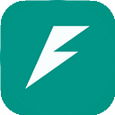
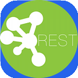
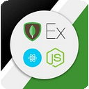
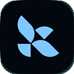
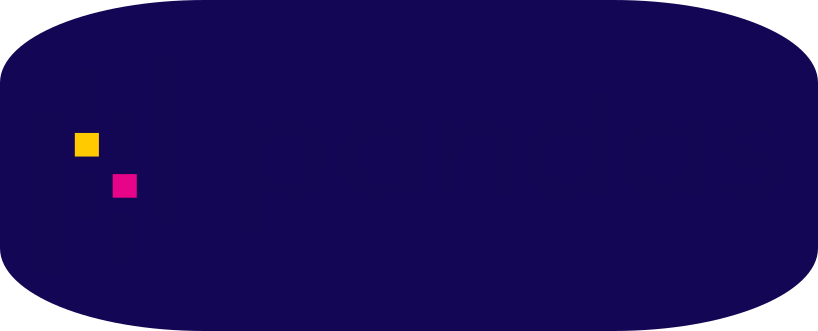
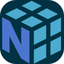
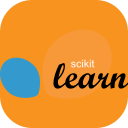
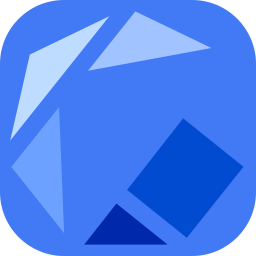
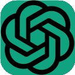
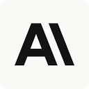

<p align="center">
  
</p>

<p align="center">
  
</p>

<p align="center">
  
  
  
</p>

<p align="center">
  <a href="https://sabdullahportfolio-web.vercel.app"></a>
  <a href="https://linkedin.com/in/syedabdullahyaqoob"></a>
  <a href="mailto:abdullah2684511@gmail.com"></a>
  <a href="https://github.com/codewithsyedabdullah"></a>
</p>

<p align="center">
  
  
  
</p>

<br>

<br>

<p align="center">
  
</p>

```bash
ROLE="AI & Backend Engineer"
EXPERIENCE="LLM pipelines · RESTful microservices · cloud-native infrastructure"
DOMAIN="Fintech  |  AI/ML  |  SaaS  |  Edtech"
STACK="Python · TypeScript · Node.js · React · AWS · Docker · K8s · LLMs"  
OPEN_TO="SWE Intern  ·  AI/ML Intern  ·  Backend Developer  ·  Full-Stack Developer"
```

<p align="center">
  <b>Building production systems where AI meets infrastructure - LLM inference on AWS Lambda, containerized microservices, fintech apps with agentic AI. First-year CS · NUST · 3.77 GPA.</b>
</p>

<br>

<br>

<p align="center">
  
</p>

<br>


<p align="center"><b>Languages</b></p>
<p align="center">
  </p>

<p align="center"><b>Frontend</b></p>
<p align="center">
  
  
  
  
  
  </p>

<p align="center"><b>Backend & API</b></p>
<p align="center">
  
  
  
  
  
  
  
  
  
  </p>

<p align="center"><b>Cloud & DevOps</b></p>
<p align="center">
  
  </p>

<p align="center"><b>Databases</b></p>
<p align="center">
  
</p>

<p align="center"><b>AI & ML</b></p>
<p align="center">
  
  
  
  
  
  </p>

<p align="center"><b>AI Platforms</b></p>
<p align="center">
  
  
  
  </p>

<p align="center"><b>Platforms & Tools</b></p>
<p align="center">
  
  
</p>
<br>

<br>

<p align="center">
  
</p>

<br>

| Domain | Level | Key Highlights |
|--------|-------|----------------|
| **AI / LLM Engineering** | `Production` | Prompt engineering, multi-agent orchestration, LLM inference on AWS Lambda + S3, OpenAI & Claude API |
| **Backend Systems** | `Production` | RESTful microservices, Node.js/Express, FastAPI, JWT auth, MVC, 40% latency reduction |
| **Cloud Infrastructure** | `Production` | AWS (EC2, S3, Lambda), Docker, Kubernetes, GitHub Actions, 50% faster deploys |
| **Full-Stack Development** | `Production` | React/Next.js, Node.js, PostgreSQL/MongoDB, RBAC, JWT, dark/light mode |
| **Enterprise Java** | `Proficient` | JavaFX/Swing, JDBC, MVC, ACID transactions, connection pooling |
| **Data & Analytics** | `Proficient` | TensorFlow, scikit-learn, Pandas/NumPy, A/B testing, Recharts dashboards |

<br>

<br>

<p align="center">
  
</p>

<br>

<div style="width: 100%; box-sizing: border-box; padding: 0;">
<details open>
<summary><b>AUTO CFO</b> - AI Financial Twin & Tax Filer</summary>

| Attribute | Detail |
|-----------|--------|
| **Stack** | React · TypeScript · Node.js · Express · SQLite · OpenAI/Claude API · JWT · Recharts |
| **Impact** | 🏆 Fintech Track Hackathon Winner |
| **Links** | [`repo`](https://github.com/codewithsyedabdullah/AutonomousCFO) |

- Architected full-stack RESTful API with JWT auth (Fintech Track, Hackathon Winner)
- Built composite Financial Health Score algorithm with real-time net worth + goal-tracking dashboards
- Integrated prompt-engineered Claude/GPT-4o AI Chat with dynamic context injection and proactive risk alerts
- Built Pakistan IRS (FBR) Tax Lawyer module: auto-calculated tax slabs, deductions, one-click PDF generation
- Engineered Scenario Simulator with 12-month Recharts projections + CSV bulk-import pipeline
- Deployed cross-platform on Vercel + Railway with responsive cross-browser Tailwind CSS UI
</details>

<br>

<details>
<summary><b>AI Chatbot Widget</b> - Multi-Industry Assistant</summary>

| Attribute | Detail |
|-----------|--------|
| **Stack** | React · Supabase · OpenAI/Claude API · Tailwind CSS · Vite · Vercel |
| **Impact** | Sub-200ms async response, 6 industry verticals |

- Built embeddable AI chatbot with prompt-engineered support for 6 industry verticals + lead capture
- Added human escalation routing, Supabase persistent storage, localStorage fallback, React Context API
- Deployed on Vercel with responsive Tailwind CSS theming and sub-200ms async message handling
</details>

<br>

<details>
<summary><b>Secure Task Management System</b></summary>

| Attribute | Detail |
|-----------|--------|
| **Stack** | React · Node.js · Express · PostgreSQL · Passport.js · CSS · Railway · Vercel |
| **Impact** | Production-deployed with RBAC, multi-assignee support |

- Implemented session-based auth (Passport.js, bcrypt, HTTP-only cookies) with RESTful CRUD APIs
- Enforced RBAC for team creators and assignees; deployed on Railway + Vercel with Safari API proxy fix
- Delivered multi-assignee tasks, due-date reminders, persistent dark/light mode UI
</details>

<br>

<details>
<summary><b>OmniTrack</b> - Logistics Tracker</summary>

| Attribute | Detail |
|-----------|--------|
| **Stack** | Java · JavaFX/Swing · MySQL · JDBC · MVC |
| **Impact** | ACID-compliant transactions, enterprise GUI |

- Built enterprise Java GUI for supply chain management with ACID-compliant MySQL transactions via JDBC
- Implemented connection pooling, full CRUD operations, RBAC login using MVC architecture
</details>

<br>

<details>
<summary><b>MiniChat</b> - WinForms AI Chatbot</summary>

| Attribute | Detail |
|-----------|--------|
| **Stack** | C# · .NET · OpenAI API · SQL |
| **Impact** | 35% query resolution time reduction |

- Reduced query resolution time by 35% with multi-form C#/.NET AI chatbot via prompt-engineered OpenAI API
- Features persistent SQL chat history, async message handling, sub-200ms response rendering
</details>
</div>

<br>

<br>

<p align="center">
  
</p>

<br>

<pre>
<b>FlyRank AI</b> · Backend AI Engineer · Remote
<b>June 2026 - Present</b>

  • Boosted AI content ranking accuracy by 35% (A/B test) by engineering LLM pipelines on AWS Lambda + S3
  • Deployed scalable serverless inference pipelines for real-time AI content ranking at production scale
  • Reduced backend API latency by 40% (profiler) by building RESTful Node.js/Express microservices on AWS EC2
  • Containerized all microservices with Docker for consistent reproducible deployment environments
  • Cut deployment time by 50% (sprint log) via automated CI/CD with GitHub Actions + Kubernetes
  • Achieved zero-downtime rollouts using Kubernetes rolling update strategies

  <code>Python  Node.js  AWS Lambda  Docker  Kubernetes  GitHub Actions  LLMs</code>

<b>NUST CS Society (NCSS)</b> · Development Lead & President · Karachi
<b>April 2025 - Present</b>

  • Scaled membership 40% (sign-up data) by designing a full-year Agile/Scrum roadmap of 6+ events per semester
  • Deployed society site on AWS S3 + Vercel with automated builds and responsive cross-browser UI
  • Cut event setup time by 30% (ops log) by automating infrastructure via CI/CD GitHub Actions
  • Integrated Salesforce CRM for member engagement tracking and data-driven event planning

  <code>React  AWS S3  Vercel  Salesforce  GitHub Actions  Agile/Scrum</code>

<b>NUST Robotics & AI (NRAI)</b> · Software Engineer · Karachi
<b>September 2025 - Present</b>

  • Reduced integration defects by 30% across 3 prototypes via modular Python/Node.js components
  • Integrated TensorFlow inference and Pandas/NumPy data pipelines into AI automation prototypes
  • Accelerated prototype delivery by 25% (sprint velocity) by containerizing services with Docker + Kubernetes on AWS EC2
  • Improved codebase maintainability by 20% (peer review) via RESTful API design and CI/CD pipelines
  • Maintained technical documentation across all prototypes with Git branching workflows

  <code>Python  TensorFlow  Docker  Kubernetes  AWS EC2  REST API</code>
</pre>

<br>

<br>

<p align="center">
  
</p>

<br>

<div align="center">

| | |
|---|---|
| 🏆 | **Hackathon Winner** - Fintech Track (AUTO CFO) |
| 🎯 | **NIC Karachi Ambassador** - 1 of 30 selected, top startup incubator |
| 🏅 | **IELTS Band 8** - CEFR C1 professional proficiency |
| 📚 | **3.77 GPA** - BS Computer Science, NUST |
| 👨‍🏫 | **Student Mentor** - 10+ juniors mentored, 3 shipped projects in 6 weeks |
| 🌍 | **Community** - Taught 80+ students robotics & Python across 3 free workshops |
| 🗳️ | **Class Representative** - Resolved 90% of student-faculty conflicts within 48 hours |

</div>

<br>

<br>

<p align="center">
  
</p>

<br>

<p align="center">
  
  
  
  
</p>
<p align="center">
  
  
</p>

<br>

<br>

<p align="center">
  
</p>

<br>

<p align="center">
  
  
  
</p>

<br>

<br>

<p align="center">
  
</p>

<br>

<p align="center">
  
  
</p>

<p align="center">
  
</p>

<p align="center">
  
</p>

<br>

<br>

<p align="center">
  
</p>

<br>

```yaml
currently:
  building:
    - AUTO CFO: AI-powered financial twin with tax filing, scenario simulation, agentic AI chat
    - Serverless LLM inference pipelines at production scale on AWS infrastructure
  learning:
    - Advanced Kubernetes orchestration & Helm charts
    - Production MLOps pipelines & model deployment
    - System design for scalable fintech platforms
    - Salesforce Apex & Lightning Web Components
  exploring:
    - Agentic AI workflows with LangChain & multi-agent orchestration
    - Real-time data streaming with WebSockets & Redis
    - AI content ranking optimization via A/B testing frameworks
  open_to:
    - Software Engineering Intern (Summer 2027)
    - AI/ML Engineering Intern
    - Backend Developer Intern
    - Full-Stack Developer Intern
```

<br>

<br>

<p align="center">
  
</p>

<br>

<p align="center">
  <a href="https://sabdullahportfolio-web.vercel.app"></a>
  <a href="https://linkedin.com/in/syedabdullahyaqoob"></a>
  <a href="mailto:abdullah2684511@gmail.com"></a>
  <a href="https://github.com/codewithsyedabdullah"></a>
</p>

<br>

<p align="center">
  <b>"Systems that ship. Metrics that move. Code that scales."</b>
</p>

<br>

<p align="center">
  
</p>

